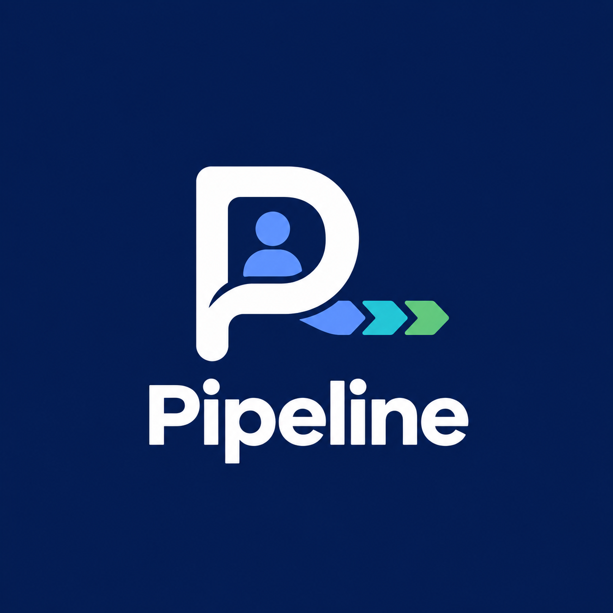

# Pipeline — Job Search Command Center

<div align="center">
  
  <h3>The Unified Career Command Center for High-Performing Engineers</h3>
  <p>Track applications, manage interviews with the STAR framework, analyze resume conversion yields, compare offers side-by-side, configure live integrations, and navigate seamlessly across desktop and mobile.</p>

  [](https://github.com/pipeline/pipeline/actions/workflows/ci.yml)
  [](https://dotnet.microsoft.com/)
  [](https://react.dev/)
  [](https://www.typescriptlang.org/)
  [](https://tailwindcss.com/)
  [](https://www.postgresql.org/)
  [](LICENSE)
</div>

---

## 1. Quick Start Guides

Pipeline supports two execution models: **Zero-Docker Local Development** (instant startup using lightweight SQLite) and **Full Docker Stack** (production-grade with PostgreSQL, MinIO, Mailpit, and Caddy).

### Path A: Zero-Docker Local Run (Recommended for Dev)

No Docker required. Runs directly on your machine with zero background daemon overhead.

```powershell
# Prerequisites: .NET 8 SDK and Node.js 18+

# 1. Clone repository
git clone https://github.com/pipeline/pipeline.git
cd Pipeline

# 2. Start Backend API (Terminal 1 - runs on port 5000 with SQLite)
cd backend/src/Pipeline.Api
dotnet run --launch-profile http

# 3. Start Frontend (Terminal 2 - runs on port 5173 with Vite proxy)
cd frontend
npm install
npm run dev

# 4. Open in browser:
# -> Web App: http://localhost:5173
# -> API Docs: http://localhost:5000/swagger
```

---

### Path B: Production Docker Compose Stack

Runs the full microservice suite with PostgreSQL 16, MinIO S3 object storage, Mailpit SMTP testing server, ASP.NET Core API, Vite frontend, and Caddy reverse proxy.

```bash
# 1. Configure environment
cp .env.example .env

# 2. Boot all services
docker compose up -d

# 3. Access endpoints:
# -> Web App:  http://localhost:5173
# -> API Docs: http://localhost:5000/swagger
# -> Mailpit:  http://localhost:8025
# -> MinIO:    http://localhost:9001 (minio / minioadmin)
```

---

## 2. Core Feature Catalog

### 🎯 Multi-Step Onboarding Wizard & Guided App Tour
- **Career Goal Calibration:** Set your target role, preferred work arrangement (Remote / Hybrid / On-site), and salary expectations on your first login.
- **Replayable App Tour:** Interactive 4-slide walkthrough explaining key capabilities (available anytime via the **Tour** button in the top navigation header).
- **Fast-Start Opportunity Add:** Log your current in-progress opportunity immediately or skip directly to the command center.

### 📋 Visual Kanban Pipeline & Historical Date Backfilling
- **Drag-and-Drop Stages:** Move applications across `Wishlist`, `Applied`, `Screening`, `Interview`, `Assignment`, `Offer`, `Accepted`, and closed lanes (`Rejected`, `Ghosted`, `Withdrawn`).
- **Historical Date Logging:** Forgotten applications can be backfilled with their true past application date for accurate timeline velocity tracking.
- **Future Date Protection:** Strict validation on both client and backend prevents accidental future timestamps.
- **Sorting & Filtering:** Instant live text filter by company or role, stage filters, and priority stars.

### 📱 Mobile-First Responsive Shell (Adaptive Drawer)
- **Sliding Navigation Drawer:** On mobile viewports (`< 768px`), navigation tucks into an animated sliding drawer with backdrop blur.
- **Touch Kanban Swiping:** Smooth horizontal swipe snapping (`snap-x`, `snap-start`, `touch-pan-x`) tailored for phones.
- **Responsive Modals:** All dialogs and forms scale down to 375px screens (iPhone SE/Mini) with zero horizontal overflow.

### 🔌 In-App Integrations Hub (With `.env` Fallback)
- **SMTP Email Delivery:** Enter your personal SMTP credentials (e.g. Gmail App Password, SendGrid, Mailgun) directly from **Settings > Integrations**, with a built-in **"Send Test Email"** verification button.
- **Safe Fallback:** If custom credentials are not provided, Pipeline seamlessly falls back to system `.env` defaults.
- **Google Calendar & OAuth:** Configure Google client ID and secret for live Google Workspace calendar synchronization.
- **Storage Provider Preference:** Toggle between Local filesystem storage (zero setup) and Cloud S3 / MinIO buckets.
- **Security by Design:** Passwords and API secrets are masked (`••••••••`) and never leaked in plain text over GET endpoints.

### 👥 Networking Intelligence & Contact Warmth
- **Relationship Warmth Score:** 1 to 5 star rating tracking champion/recruiter rapport.
- **Interaction Timeline:** Log emails, phone calls, coffee chats, and LinkedIn messages directly linked to an application.
- **Automated Outreach Reminders:** Alerts triggered when a key recruiter has gone cold.

### 🎤 STAR Framework Interview Preparation & Debriefs
- **Structured Debriefs:** Record interview questions, categorized by type (Technical, Behavioral, System Design), and document responses using Situation, Task, Action, and Result (STAR).
- **Live ICS Calendar Feed:** Subscribe to your private `.ics` URL token in Google Calendar, Apple Calendar, or Outlook for bi-directional event tracking.

### 📄 Resume Tailoring & Version Conversion Yield
- **CV Version Tracking:** Upload and link customized resumes and cover letters to specific applications.
- **Conversion Metrics:** Analytics reveal which resume version produces the highest interview conversion rate.

### ⚖️ Offer Comparison Matrix
- **Side-by-Side Compensation Analysis:** Compare base salary, bonuses, equity value, commuting difficulty, and culture score.
- **Decision Deadlines:** Countdown clocks highlight impending offer expiration dates.

### 🛡️ Data Portability & GDPR Compliance
- **Complete Export:** Download your entire career archive in machine-readable JSON (GDPR Article 20 compliant).
- **CSV Data Import/Export:** Import bulk past applications from spreadsheets with RFC 4180 parsing and validation error reports.
- **Account Cascade Purge:** Permanently remove your account and all associated entities in one click.

---

## 3. Configuration & Architecture

Pipeline strictly separates **Infrastructure Secrets** from **User Service Integrations**:

```
+-------------------------------------------------------------------+
|                        PIPELINE ARCHITECTURE                      |
+-------------------------------------------------------------------+
|                                                                   |
|   INFRASTRUCTURE BOOTSTRAP (.env)                                 |
|   • Database Connection Strings (Postgres / SQLite)               |
|   • Host Server Ports & CORS Origins                              |
|   • JWT Symmetric Signing Secret                                  |
|   (Required before the server can start; never exposed to UI)     |
|                                                                   |
|   USER INTEGRATIONS (Settings > Integrations UI)                  |
|   • Custom SMTP Outgoing Mail (Gmail, SendGrid, etc.)             |
|   • Google Calendar OAuth Client ID & Secret                      |
|   • Storage Provider Preference (Local vs S3)                     |
|   (Configurable per user in DB; gracefully falls back to .env)    |
|                                                                   |
+-------------------------------------------------------------------+
```

### Environment Variables Reference

| Variable | Default Value | Purpose |
|---|---|---|
| `ConnectionStrings__Default` | `Data Source=pipeline.db` (Dev) | ADO.NET connection string (SQLite or PostgreSQL) |
| `Jwt__Secret` | `change-me-32+chars...` | Symmetric HMAC-SHA256 signing key |
| `Frontend__Origin` | `http://localhost:5173` | Allowed CORS origin for web app |
| `Smtp__Host` | `localhost` | Fallback SMTP server address |
| `Smtp__Port` | `1025` | Fallback SMTP server port |
| `Smtp__From` | `no-reply@pipeline.local` | Fallback sender email address |
| `Storage__Provider` | `Local` (Dev) / `S3` (Docker) | Fallback storage engine |
| `Storage__Endpoint` | `http://localhost:9000` | S3-compatible service URL (MinIO, AWS) |
| `AUTO_MIGRATE` | `true` | Apply database schema migrations on startup |

---

## 4. Repository Structure

```
Pipeline/
├── backend/
│   ├── src/
│   │   ├── Pipeline.Domain/           # Core Entities, Enums, BaseEntity, Domain interfaces
│   │   ├── Pipeline.Application/      # CQRS/Services, DTOs, Business validation rules
│   │   ├── Pipeline.Infrastructure/   # EF Core DbContext, MailKit SMTP, S3 Storage, Auth
│   │   └── Pipeline.Api/              # ASP.NET Core 8 Web API, Controllers, Middleware
│   └── tests/
│       └── Pipeline.Tests/            # Unit & Integration test suites (105+ tests)
├── frontend/
│   ├── src/
│   │   ├── app/                       # Routing and App Provider setup
│   │   ├── components/                # Layout, Sidebar Drawer, Header, Command Palette
│   │   ├── features/
│   │   │   ├── applications/          # Kanban Board, Table, History, Backfilled Date modals
│   │   │   ├── onboarding/            # Multi-step Onboarding Wizard, Replayable Tour
│   │   │   ├── settings/              # Profile, Rules, Integrations Tab, Data Management
│   │   │   ├── interviews/            # STAR Question Bank, Checklists, Debriefs
│   │   │   ├── documents/             # CV versioning, Tailoring analytics
│   │   │   └── offers/                # Comparison matrix, Scoring calculators
│   │   └── lib/                       # Axios API client, Theme management
│   ├── tests/                         # Vitest + React Testing Library suites (53+ tests)
│   └── verify-*.cjs                   # Playwright E2E verification test scripts
├── docker-compose.yml                 # Local development multi-container stack
├── docker-compose.prod.yml            # Production VPS stack with Caddy HTTPS
└── README.md                          # You are here
```

---

## 5. Development, Testing & Verification

Pipeline adheres to strict Test-Driven Development (TDD) across all layers:

```bash
# 1. Run Backend Unit & Integration Tests (105 tests)
dotnet test backend/Pipeline.sln

# 2. Run Frontend Unit & Component Tests (53 tests)
cd frontend
npm test

# 3. Validate Production Bundle Compilation
npm run build

# 4. Run End-to-End Browser Automation (Playwright)
node verify-mobile-and-onboarding.cjs
node verify-integrations-tab.cjs
```

---

## 6. Production VPS Deployment Guide

Deploy Pipeline to an Ubuntu VPS (DigitalOcean, Hetzner, Linode) with automated HTTPS via Caddy:

```bash
# 1. Clone repository to server
git clone https://github.com/pipeline/pipeline.git /opt/pipeline
cd /opt/pipeline

# 2. Configure production secrets
cp .env.example .env
nano .env
# Set DOMAIN=pipeline.yourdomain.com
# Set secure POSTGRES_PASSWORD, Jwt__Secret, and Smtp credentials

# 3. Launch stack
docker compose -f docker-compose.prod.yml up -d --build
```
Caddy will automatically provision and renew a free Let's Encrypt TLS certificate for your domain.

---

## 7. Troubleshooting & FAQ

#### Q: Getting `MSB3027: Could not copy Pipeline.*.dll because it is locked` during `dotnet test`?
**A:** On Windows, if `Pipeline.Api` is currently running, its DLLs are locked by the runtime. Stop the running API process before running tests:
```powershell
Get-Process Pipeline.Api -ErrorAction SilentlyContinue | Stop-Process -Force
```

#### Q: How do I reset or clear my local SQLite database?
**A:** Simply delete `backend/src/Pipeline.Api/pipeline.db`. On next launch, EF Core will automatically recreate the database and schema migrations.

#### Q: What if I don't configure SMTP in Settings?
**A:** Pipeline will automatically fall back to the system `.env` defaults (or Mailpit in Docker), ensuring you never lose notifications.

---

## 8. License

Distributed under the MIT License. See [LICENSE](LICENSE) for details.
